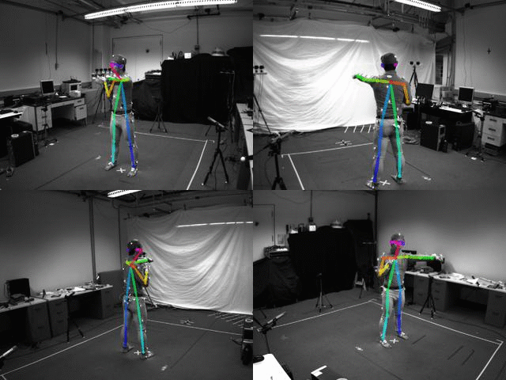

## RNN for Human Activity Recognition - 2D Pose Input

This experiment is the classification of human activities using a 2D pose time series dataset and an LSTM RNN.
The idea is to prove the concept that using a series of 2D poses, rather than 3D poses or a raw 2D images, can produce an accurate estimation of the behaviour of a person or animal.
This is a step towards creating a method of classifying an animal's current behaviour state and predicting it's likely next state, allowing for better interaction with an autonomous mobile robot.

## Objectives

The aims of this experiment are:

-  To determine if 2D pose has comparable accuracy to 3D pose for use in activity recognition. This would allow the use of RGB only cameras for human and animal pose estimation, as opposed to RGBD or a large motion capture dataset.


- To determine if  2D pose has comparable accuracy to using raw RGB images for use in activity recognition. This is based on the idea that limiting the input feature vector can help to deal with a limited dataset, as is likely to occur in animal activity recognition, by allowing for a smaller model to be used (citation required).


- To verify the concept for use in future works involving behaviour prediction from motion in 2D images.

The network used in this experiment is based on that of Guillaume Chevalier, 'LSTMs for Human Activity Recognition, 2016'  https://github.com/guillaume-chevalier/LSTM-Human-Activity-Recognition, available under the MIT License.
Notable changes that have been made (other than accounting for dataset sizes) are:
 - Adapting for use with a large dataset ordered by class, using random sampling without replacement for mini-batch.  
 This allows for use of smaller batch sizes when using a dataset ordered by class. "It has been observed in practice that when using a larger batch there is a significant degradation in the quality of the model, as measured by its ability to generalize"  
      _N.S Keskar, D. Mudigere, et al, 'On Large-Batch Training for Deep Learning: Generalization Gap and Sharp 
      Minima', ICLR 2017_ https://arxiv.org/abs/1609.04836
      
 - Exponentially decaying learning rate implemented


## Dataset overview

The dataset consists of pose estimations, made using the software OpenPose (https://github.com/CMU-Perceptual-Computing-Lab/openpose's) on a subset of the Berkeley Multimodal Human Action Database (MHAD) dataset http://tele-immersion.citris-uc.org/berkeley_mhad.

This dataset is comprised of 12 subjects doing the following 6 actions for 5 repetitions, filmed from 4 angles, repeated 5 times each.  

- JUMPING,
- JUMPING_JACKS,
- BOXING,
- WAVING_2HANDS,
- WAVING_1HAND,
- CLAPPING_HANDS.

In total, there are 1438 videos (2 were missing) made up of 211200 individual frames.

The below image is an example of the 4 camera views during the 'boxing' action for subject 1



The input for the LSTM is the 2D position of 18 joints across a timeseries of frames numbering n_steps (window-width), with an associated class label for the frame series.  
A single frame's input (where j refers to a joint) is stored as:

[  j0_x,  j0_y, j1_x, j1_y , j2_x, j2_y, j3_x, j3_y, j4_x, j4_y, j5_x, j5_y, j6_x, j6_y, j7_x, j7_y, j8_x, j8_y, j9_x, j9_y, j10_x, j10_y, j11_x, j11_y, j12_x, j12_y, j13_x, j13_y, j14_x, j14_y, j15_x, j15_y, j16_x, j16_y, j17_x, j17_y ]

For the following experiment, very little preprocessing has been done to the dataset.  
The following steps were taken:
1. openpose run on individual frames, for each subject, action and view, outputting JSON of 18 joint x and y position keypoints and accuracies per frame
2. JSONs converted into txt format, keeping only x and y positions of each frame, action being performed during frame, and order of frames. This is used to create a database of associated activity class number and corresponding series of joint 2D positions
3. No further prepossessing was performed.  

In some cases, multiple people were detected in each frame, in which only the first detection was used.

The data has not been normalised with regards to subject position in the frame, motion across frame (if any), size of the subject, speed of action etc. It is essentially the raw 2D position of each joint viewed from a stationary camera.  
In many cases, individual joints were not located and a position of [0.0,0.0] was given for that joint

A summary of the dataset used for input is:

 - 211200 individual images 
 - n_steps = 32 frames (~=1.5s at 22Hz)
 - Images with noisy pose detection (detection of >=2 people) = 5132  
 - Training_split = 0.8
 - Overlap = 0.8125 (26 / 32) ie 26 frame overlap
   - Length X_train = 22625 * 32 frames
   - Length X_test = 5751 * 32 frames
   
Note that their is no overlap between test and train sets, which were seperated by activity repetition entirely, before creating the 26 of 32 frame overlap.


## Training and Results below: 
Training took approximately 4 mins running on a single GTX1080Ti, and was run for 22,000,000ish iterations with a batch size of 5000  (600 epochs)


```python
from google.colab import drive
drive.mount('/content/drive')
```

    Drive already mounted at /content/drive; to attempt to forcibly remount, call drive.mount("/content/drive", force_remount=True).


```python
%tensorflow_version 1.x
import numpy as np
import matplotlib
import matplotlib.pyplot as plt
import tensorflow as tf  # Version 1.0.0 (some previous versions are used in past commits)
from sklearn import metrics
import random
from random import randint
import time
import os
from sklearn.model_selection import train_test_split
```

    TensorFlow 1.x selected.


```python
%cd /content/drive/MyDrive/Colab/Ngoc_K62/RNN-for-Human-Activity-Recognition-using-2D-Pose-Input/
```

    /content/drive/MyDrive/Colab/Ngoc_K62/RNN-for-Human-Activity-Recognition-using-2D-Pose-Input


## Preparing dataset:


```python
# Useful Constants

# Output classes to learn how to classify
LABELS = [    
    "Crouch",
    "Lyin",
    "Run",
    "Sit",
    "Stand",
    "Walk"

] 
DATASET_PATH = "data/HAR_pose_activities/database/"

X_train_path = DATASET_PATH + "X_train.txt"
X_test_path = DATASET_PATH + "X_test.txt"

y_train_path = DATASET_PATH + "Y_train.txt"
y_test_path = DATASET_PATH + "Y_test.txt"

n_steps = 1 # 32 timesteps per series
```


```python

# Load the networks inputs
def load_X_csv(X_path):
  X_= np.loadtxt(open(X_path, "rb"), delimiter=",", skiprows=1)
  blocks = int(len(X_) / 1)
  X_ = np.array(np.split(X_,blocks))
  return X_ 

def load_Y_csv(Y_path):
  Y_= np.loadtxt(open(Y_path, "rb"), delimiter=",", skiprows=1)
  Y_= Y_.astype(np.int32)
  Y_ = Y_.reshape((len(Y_),1))
  return Y_ -1 

def load_X(X_path):
    file = open(X_path, 'r')
    X_ = np.array(
        [elem for elem in [
            row.split(',') for row in file
        ]], 
        dtype=np.float32
    )
    file.close()
    blocks = int(len(X_) / n_steps)
    X_ = np.array(np.split(X_,blocks))

    return X_ 

# Load the networks outputs

def load_y(y_path):
    file = open(y_path, 'r')
    y_ = np.array(
        [elem for elem in [
            row.replace('  ', ' ').strip().split(' ') for row in file
        ]], 
        dtype=np.int32
    )
    file.close()
    
    # for 0-based indexing 
    return y_ - 1

#X_train = load_X(X_train_path)
X_train = load_X_csv(DATASET_PATH + "x.csv")
#X_test = load_X(X_test_path)
#print (load_X(DATASET_PATH + "X_train.txt").shape)
#print (x_train.shape)

#y_train = load_y(y_train_path)
y_train = load_Y_csv(DATASET_PATH + "y.csv")
#y_test = load_y(y_train_path)
X_train, X_test, y_train, y_test = train_test_split(X_train, y_train, test_size=0.33, random_state=42)
print (y_train.shape)
print (y_test.shape)
```

    (4490, 1)
    (2212, 1)


## Set Parameters:


```python
# Input Data 

training_data_count = len(X_train)  # 4519 training series (with 50% overlap between each serie)
test_data_count = len(X_test)  # 1197 test series
n_input = len(X_train[0][0])  # num input parameters per timestep

n_hidden = 34 # Hidden layer num of features
n_classes = 6 

#updated for learning-rate decay
# calculated as: decayed_learning_rate = learning_rate * decay_rate ^ (global_step / decay_steps)
decaying_learning_rate = True
learning_rate = 0.0025 #used if decaying_learning_rate set to False
init_learning_rate = 0.005
decay_rate = 0.96 #the base of the exponential in the decay
decay_steps = 100000 #used in decay every 60000 steps with a base of 0.96

global_step = tf.Variable(0, trainable=False)
lambda_loss_amount = 0.0015

training_iters = training_data_count *10000  # Loop 300 times on the dataset, ie 300 epochs
batch_size = 4096
display_iter = batch_size*8  # To show test set accuracy during training

print("(X shape, y shape, every X's mean, every X's standard deviation)")
print(X_train.shape, y_test.shape, np.mean(X_test), np.std(X_test))
print("\nThe dataset has not been preprocessed, is not normalised etc")


```

    (X shape, y shape, every X's mean, every X's standard deviation)
    (4490, 1, 36) (2212, 1) 0.33658941922288776 0.21569429759686076
    
    The dataset has not been preprocessed, is not normalised etc


## Utility functions for training:


```python
def LSTM_RNN(_X, _weights, _biases):
    # model architecture based on "guillaume-chevalier" and "aymericdamien" under the MIT license.

    _X = tf.transpose(_X, [1, 0, 2])  # permute n_steps and batch_size
    _X = tf.reshape(_X, [-1, n_input])   
    # Rectifies Linear Unit activation function used
    _X = tf.nn.relu(tf.matmul(_X, _weights['hidden']) + _biases['hidden'])
    # Split data because rnn cell needs a list of inputs for the RNN inner loop
    _X = tf.split(_X, n_steps, 0) 

    # Define two stacked LSTM cells (two recurrent layers deep) with tensorflow
    lstm_cell_1 = tf.contrib.rnn.BasicLSTMCell(n_hidden, forget_bias=1.0, state_is_tuple=True)
    lstm_cell_2 = tf.contrib.rnn.BasicLSTMCell(n_hidden, forget_bias=1.0, state_is_tuple=True)
    lstm_cells = tf.contrib.rnn.MultiRNNCell([lstm_cell_1, lstm_cell_2], state_is_tuple=True)
    outputs, states = tf.contrib.rnn.static_rnn(lstm_cells, _X, dtype=tf.float32)

    # A single output is produced, in style of "many to one" classifier, refer to http://karpathy.github.io/2015/05/21/rnn-effectiveness/ for details
    lstm_last_output = outputs[-1]
    
    # Linear activation
    return tf.matmul(lstm_last_output, _weights['out']) + _biases['out']


def extract_batch_size(_train, _labels, _unsampled, batch_size):
    # Fetch a "batch_size" amount of data and labels from "(X|y)_train" data. 
    # Elements of each batch are chosen randomly, without replacement, from X_train with corresponding label from Y_train
    # unsampled_indices keeps track of sampled data ensuring non-replacement. Resets when remaining datapoints < batch_size    
    
    shape = list(_train.shape)
    shape[0] = batch_size
    batch_s = np.empty(shape)
    batch_labels = np.empty((batch_size,1)) 

    for i in range(batch_size):
        # Loop index
        # index = random sample from _unsampled (indices)
        index = random.choice(_unsampled)
        batch_s[i] = _train[index] 
        batch_labels[i] = _labels[index]
        _unsampled.remove(index)


    return batch_s, batch_labels, _unsampled


def one_hot(y_):
    # One hot encoding of the network outputs
    # e.g.: [[5], [0], [3]] --> [[0, 0, 0, 0, 0, 1], [1, 0, 0, 0, 0, 0], [0, 0, 0, 1, 0, 0]]
    
    y_ = y_.reshape(len(y_))
    n_values = int(np.max(y_)) + 1
    return np.eye(n_values)[np.array(y_, dtype=np.int32)]  # Returns FLOATS


```

## Build the network:


```python

# Graph input/output
x = tf.placeholder(tf.float32, [None, n_steps, n_input])
#x = tf.placeholder(tf.float32, [None, 32, n_input])
y = tf.placeholder(tf.float32, [None, n_classes])

# Graph weights
weights = {
    'hidden': tf.Variable(tf.random_normal([n_input, n_hidden])), # Hidden layer weights
    'out': tf.Variable(tf.random_normal([n_hidden, n_classes], mean=1.0))
}
biases = {
    'hidden': tf.Variable(tf.random_normal([n_hidden])),
    'out': tf.Variable(tf.random_normal([n_classes]))
}

pred = LSTM_RNN(x, weights, biases)

# Loss, optimizer and evaluation
l2 = lambda_loss_amount * sum(
    tf.nn.l2_loss(tf_var) for tf_var in tf.trainable_variables()
) # L2 loss prevents this overkill neural network to overfit the data
cost = tf.reduce_mean(tf.nn.softmax_cross_entropy_with_logits(labels=y, logits=pred)) + l2 # Softmax loss
if decaying_learning_rate:
    learning_rate = tf.train.exponential_decay(init_learning_rate, global_step*batch_size, decay_steps, decay_rate, staircase=True)


#decayed_learning_rate = learning_rate * decay_rate ^ (global_step / decay_steps) #exponentially decayed learning rate
optimizer = tf.train.AdamOptimizer(learning_rate=learning_rate).minimize(cost,global_step=global_step) # Adam Optimizer

correct_pred = tf.equal(tf.argmax(pred,1), tf.argmax(y,1))
accuracy = tf.reduce_mean(tf.cast(correct_pred, tf.float32))


```

    WARNING:tensorflow:
    The TensorFlow contrib module will not be included in TensorFlow 2.0.
    For more information, please see:
      * https://github.com/tensorflow/community/blob/master/rfcs/20180907-contrib-sunset.md
      * https://github.com/tensorflow/addons
      * https://github.com/tensorflow/io (for I/O related ops)
    If you depend on functionality not listed there, please file an issue.
    
    WARNING:tensorflow:From <ipython-input-7-a1d7a6b10f56>:12: BasicLSTMCell.__init__ (from tensorflow.python.ops.rnn_cell_impl) is deprecated and will be removed in a future version.
    Instructions for updating:
    This class is equivalent as tf.keras.layers.LSTMCell, and will be replaced by that in Tensorflow 2.0.
    WARNING:tensorflow:From <ipython-input-7-a1d7a6b10f56>:14: MultiRNNCell.__init__ (from tensorflow.python.ops.rnn_cell_impl) is deprecated and will be removed in a future version.
    Instructions for updating:
    This class is equivalent as tf.keras.layers.StackedRNNCells, and will be replaced by that in Tensorflow 2.0.
    WARNING:tensorflow:From <ipython-input-7-a1d7a6b10f56>:15: static_rnn (from tensorflow.python.ops.rnn) is deprecated and will be removed in a future version.
    Instructions for updating:
    Please use `keras.layers.RNN(cell, unroll=True)`, which is equivalent to this API
    WARNING:tensorflow:From /tensorflow-1.15.2/python3.7/tensorflow_core/python/ops/rnn_cell_impl.py:735: Layer.add_variable (from tensorflow.python.keras.engine.base_layer) is deprecated and will be removed in a future version.
    Instructions for updating:
    Please use `layer.add_weight` method instead.
    WARNING:tensorflow:From /tensorflow-1.15.2/python3.7/tensorflow_core/python/ops/rnn_cell_impl.py:739: calling Zeros.__init__ (from tensorflow.python.ops.init_ops) with dtype is deprecated and will be removed in a future version.
    Instructions for updating:
    Call initializer instance with the dtype argument instead of passing it to the constructor
    WARNING:tensorflow:From <ipython-input-8-386bf58ae5d0>:23: softmax_cross_entropy_with_logits (from tensorflow.python.ops.nn_ops) is deprecated and will be removed in a future version.
    Instructions for updating:
    
    Future major versions of TensorFlow will allow gradients to flow
    into the labels input on backprop by default.
    
    See `tf.nn.softmax_cross_entropy_with_logits_v2`.
    


## Train the network:


```python
test_losses = []
test_accuracies = []
train_losses = []
train_accuracies = []
sess = tf.InteractiveSession(config=tf.ConfigProto(log_device_placement=True))
init = tf.global_variables_initializer()
sess.run(init)

# Perform Training steps with "batch_size" amount of data at each loop. 
# Elements of each batch are chosen randomly, without replacement, from X_train, 
# restarting when remaining datapoints < batch_size
step = 1
time_start = time.time()
unsampled_indices = list(range(0, len(X_train)))
while step * batch_size <= training_iters:
    #print (sess.run(learning_rate)) #decaying learning rate
    #print (sess.run(global_step)) # global number of iterations
    if len(unsampled_indices) < batch_size:
        unsampled_indices = list(range(0, len(X_train)))
         
    batch_xs, raw_labels, unsampled_indicies = extract_batch_size(X_train, y_train, unsampled_indices, batch_size)
    batch_ys = one_hot(raw_labels)
    # check that encoded output is same length as num_classes, if not, pad it 
    if len(batch_ys[0]) < n_classes:
        temp_ys = np.zeros((batch_size, n_classes))
        temp_ys[:batch_ys.shape[0],:batch_ys.shape[1]] = batch_ys
        batch_ys = temp_ys
       
    

    # Fit training using batch data
    _, loss, acc = sess.run(
        [optimizer, cost, accuracy],
        feed_dict={
            x: batch_xs, 
            y: batch_ys
        }
    )
    train_losses.append(loss)
    train_accuracies.append(acc)
    
   ### Evaluate network only at some steps for faster training: 
    if (step*batch_size % display_iter == 0) or (step == 1) or (step * batch_size > training_iters):
        
        # To not spam console, show training accuracy/loss in this "if"
        print("Iter #" + str(step*batch_size) + \
              ":  Learning rate = " + "{:.6f}".format(sess.run(learning_rate)) + \
              ":   Batch Loss = " + "{:.6f}".format(loss) + \
              ", Accuracy = {}".format(acc))
        
        # Evaluation on the test set (no learning made here - just evaluation for diagnosis)
        loss, acc = sess.run(
            [cost, accuracy], 
            feed_dict={
                x: X_test,
                y: one_hot(y_test)
            }
        )
        test_losses.append(loss)
        test_accuracies.append(acc)
        print("PERFORMANCE ON TEST SET:             " + \
              "Batch Loss = {}".format(loss) + \
              ", Accuracy = {}".format(acc))
    
    step += 1

print("Optimization Finished!")

# Accuracy for test data

one_hot_predictions, accuracy, final_loss = sess.run(
    [pred, accuracy, cost],
    feed_dict={
        x: X_test,
        y: one_hot(y_test)
    }
)

test_losses.append(final_loss)
test_accuracies.append(accuracy)

print("FINAL RESULT: " + \
      "Batch Loss = {}".format(final_loss) + \
      ", Accuracy = {}".format(accuracy))
time_stop = time.time()
print("TOTAL TIME:  {}".format(time_stop - time_start))
saver = tf.train.Saver()
saver.save(sess = sess, save_path = 'Saved model/model1')
```

    Iter #42729472:  Learning rate = 0.000000:   Batch Loss = 0.620868, Accuracy = 0.959716796875
    PERFORMANCE ON TEST SET:             Batch Loss = 0.6991473436355591, Accuracy = 0.9326401352882385
    Iter #42762240:  Learning rate = 0.000000:   Batch Loss = 0.622023, Accuracy = 0.95947265625
    PERFORMANCE ON TEST SET:             Batch Loss = 0.6991473436355591, Accuracy = 0.9326401352882385
    Iter #42795008:  Learning rate = 0.000000:   Batch Loss = 0.621379, Accuracy = 0.959228515625
    PERFORMANCE ON TEST SET:             Batch Loss = 0.6991473436355591, Accuracy = 0.9326401352882385
    Iter #42827776:  Learning rate = 0.000000:   Batch Loss = 0.623411, Accuracy = 0.958740234375
    PERFORMANCE ON TEST SET:             Batch Loss = 0.6991473436355591, Accuracy = 0.9326401352882385
    Iter #42860544:  Learning rate = 0.000000:   Batch Loss = 0.623228, Accuracy = 0.9599609375
    PERFORMANCE ON TEST SET:             Batch Loss = 0.6991473436355591, Accuracy = 0.9326401352882385
    Iter #42893312:  Learning rate = 0.000000:   Batch Loss = 0.623568, Accuracy = 0.959716796875
    PERFORMANCE ON TEST SET:             Batch Loss = 0.6991473436355591, Accuracy = 0.9326401352882385
    Iter #42926080:  Learning rate = 0.000000:   Batch Loss = 0.618229, Accuracy = 0.96044921875
    PERFORMANCE ON TEST SET:             Batch Loss = 0.6991473436355591, Accuracy = 0.9326401352882385
    Iter #42958848:  Learning rate = 0.000000:   Batch Loss = 0.621283, Accuracy = 0.9599609375
    PERFORMANCE ON TEST SET:             Batch Loss = 0.6991473436355591, Accuracy = 0.9326401352882385
    Iter #42991616:  Learning rate = 0.000000:   Batch Loss = 0.625261, Accuracy = 0.958251953125
    PERFORMANCE ON TEST SET:             Batch Loss = 0.6991473436355591, Accuracy = 0.9326401352882385
    Iter #43024384:  Learning rate = 0.000000:   Batch Loss = 0.622288, Accuracy = 0.961181640625
    PERFORMANCE ON TEST SET:             Batch Loss = 0.6991473436355591, Accuracy = 0.9326401352882385
    Iter #43057152:  Learning rate = 0.000000:   Batch Loss = 0.622595, Accuracy = 0.958984375
    PERFORMANCE ON TEST SET:             Batch Loss = 0.6991473436355591, Accuracy = 0.9326401352882385
    Iter #43089920:  Learning rate = 0.000000:   Batch Loss = 0.622020, Accuracy = 0.959716796875
    PERFORMANCE ON TEST SET:             Batch Loss = 0.6991473436355591, Accuracy = 0.9326401352882385
    Iter #43122688:  Learning rate = 0.000000:   Batch Loss = 0.622989, Accuracy = 0.958740234375
    PERFORMANCE ON TEST SET:             Batch Loss = 0.6991473436355591, Accuracy = 0.9326401352882385
    Iter #43155456:  Learning rate = 0.000000:   Batch Loss = 0.621344, Accuracy = 0.95947265625
    PERFORMANCE ON TEST SET:             Batch Loss = 0.6991473436355591, Accuracy = 0.9326401352882385
    Iter #43188224:  Learning rate = 0.000000:   Batch Loss = 0.622551, Accuracy = 0.959228515625
    PERFORMANCE ON TEST SET:             Batch Loss = 0.6991473436355591, Accuracy = 0.9326401352882385
    Iter #43220992:  Learning rate = 0.000000:   Batch Loss = 0.623734, Accuracy = 0.958251953125
    PERFORMANCE ON TEST SET:             Batch Loss = 0.6991473436355591, Accuracy = 0.9326401352882385
    Iter #43253760:  Learning rate = 0.000000:   Batch Loss = 0.618761, Accuracy = 0.96044921875
    PERFORMANCE ON TEST SET:             Batch Loss = 0.6991473436355591, Accuracy = 0.9326401352882385
    Iter #43286528:  Learning rate = 0.000000:   Batch Loss = 0.621550, Accuracy = 0.960205078125
    PERFORMANCE ON TEST SET:             Batch Loss = 0.6991473436355591, Accuracy = 0.9326401352882385
    Iter #43319296:  Learning rate = 0.000000:   Batch Loss = 0.624235, Accuracy = 0.958251953125
    PERFORMANCE ON TEST SET:             Batch Loss = 0.6991473436355591, Accuracy = 0.9326401352882385
    Iter #43352064:  Learning rate = 0.000000:   Batch Loss = 0.625909, Accuracy = 0.958984375
    PERFORMANCE ON TEST SET:             Batch Loss = 0.6991473436355591, Accuracy = 0.9326401352882385
    Iter #43384832:  Learning rate = 0.000000:   Batch Loss = 0.624593, Accuracy = 0.958251953125
    PERFORMANCE ON TEST SET:             Batch Loss = 0.6991473436355591, Accuracy = 0.9326401352882385
    Iter #43417600:  Learning rate = 0.000000:   Batch Loss = 0.624380, Accuracy = 0.958740234375
    PERFORMANCE ON TEST SET:             Batch Loss = 0.6991473436355591, Accuracy = 0.9326401352882385
    Iter #43450368:  Learning rate = 0.000000:   Batch Loss = 0.624843, Accuracy = 0.958251953125
    PERFORMANCE ON TEST SET:             Batch Loss = 0.6991473436355591, Accuracy = 0.9326401352882385
    Iter #43483136:  Learning rate = 0.000000:   Batch Loss = 0.621756, Accuracy = 0.95849609375
    PERFORMANCE ON TEST SET:             Batch Loss = 0.6991473436355591, Accuracy = 0.9326401352882385
    Iter #43515904:  Learning rate = 0.000000:   Batch Loss = 0.625008, Accuracy = 0.95947265625
    PERFORMANCE ON TEST SET:             Batch Loss = 0.6991473436355591, Accuracy = 0.9326401352882385
    Iter #43548672:  Learning rate = 0.000000:   Batch Loss = 0.620407, Accuracy = 0.958984375
    PERFORMANCE ON TEST SET:             Batch Loss = 0.6991473436355591, Accuracy = 0.9326401352882385
    Iter #43581440:  Learning rate = 0.000000:   Batch Loss = 0.620557, Accuracy = 0.95947265625
    PERFORMANCE ON TEST SET:             Batch Loss = 0.6991473436355591, Accuracy = 0.9326401352882385
    Iter #43614208:  Learning rate = 0.000000:   Batch Loss = 0.622210, Accuracy = 0.960205078125
    PERFORMANCE ON TEST SET:             Batch Loss = 0.6991473436355591, Accuracy = 0.9326401352882385
    Iter #43646976:  Learning rate = 0.000000:   Batch Loss = 0.621554, Accuracy = 0.959228515625
    PERFORMANCE ON TEST SET:             Batch Loss = 0.6991473436355591, Accuracy = 0.9326401352882385
    Iter #43679744:  Learning rate = 0.000000:   Batch Loss = 0.621813, Accuracy = 0.959228515625
    PERFORMANCE ON TEST SET:             Batch Loss = 0.6991473436355591, Accuracy = 0.9326401352882385
    Iter #43712512:  Learning rate = 0.000000:   Batch Loss = 0.620013, Accuracy = 0.96044921875
    PERFORMANCE ON TEST SET:             Batch Loss = 0.6991473436355591, Accuracy = 0.9326401352882385
    Iter #43745280:  Learning rate = 0.000000:   Batch Loss = 0.623384, Accuracy = 0.95849609375
    PERFORMANCE ON TEST SET:             Batch Loss = 0.6991473436355591, Accuracy = 0.9326401352882385
    Iter #43778048:  Learning rate = 0.000000:   Batch Loss = 0.625491, Accuracy = 0.95849609375
    PERFORMANCE ON TEST SET:             Batch Loss = 0.6991473436355591, Accuracy = 0.9326401352882385
    Iter #43810816:  Learning rate = 0.000000:   Batch Loss = 0.623535, Accuracy = 0.95947265625
    PERFORMANCE ON TEST SET:             Batch Loss = 0.6991473436355591, Accuracy = 0.9326401352882385
    Iter #43843584:  Learning rate = 0.000000:   Batch Loss = 0.623185, Accuracy = 0.9580078125
    PERFORMANCE ON TEST SET:             Batch Loss = 0.6991473436355591, Accuracy = 0.9326401352882385
    Iter #43876352:  Learning rate = 0.000000:   Batch Loss = 0.622242, Accuracy = 0.959716796875
    PERFORMANCE ON TEST SET:             Batch Loss = 0.6991473436355591, Accuracy = 0.9326401352882385
    Iter #43909120:  Learning rate = 0.000000:   Batch Loss = 0.624821, Accuracy = 0.958740234375
    PERFORMANCE ON TEST SET:             Batch Loss = 0.6991473436355591, Accuracy = 0.9326401352882385
    Iter #43941888:  Learning rate = 0.000000:   Batch Loss = 0.623130, Accuracy = 0.958740234375
    PERFORMANCE ON TEST SET:             Batch Loss = 0.6991473436355591, Accuracy = 0.9326401352882385
    Iter #43974656:  Learning rate = 0.000000:   Batch Loss = 0.622998, Accuracy = 0.958984375
    PERFORMANCE ON TEST SET:             Batch Loss = 0.6991473436355591, Accuracy = 0.9326401352882385
    Iter #44007424:  Learning rate = 0.000000:   Batch Loss = 0.623083, Accuracy = 0.95849609375
    PERFORMANCE ON TEST SET:             Batch Loss = 0.6991473436355591, Accuracy = 0.9326401352882385
    Iter #44040192:  Learning rate = 0.000000:   Batch Loss = 0.626964, Accuracy = 0.95703125
    PERFORMANCE ON TEST SET:             Batch Loss = 0.6991473436355591, Accuracy = 0.9326401352882385
    Iter #44072960:  Learning rate = 0.000000:   Batch Loss = 0.621057, Accuracy = 0.959716796875
    PERFORMANCE ON TEST SET:             Batch Loss = 0.6991473436355591, Accuracy = 0.9326401352882385
    Iter #44105728:  Learning rate = 0.000000:   Batch Loss = 0.624490, Accuracy = 0.958251953125
    PERFORMANCE ON TEST SET:             Batch Loss = 0.6991473436355591, Accuracy = 0.9326401352882385
    Iter #44138496:  Learning rate = 0.000000:   Batch Loss = 0.620136, Accuracy = 0.9599609375
    PERFORMANCE ON TEST SET:             Batch Loss = 0.6991473436355591, Accuracy = 0.9326401352882385
    Iter #44171264:  Learning rate = 0.000000:   Batch Loss = 0.623083, Accuracy = 0.95849609375
    PERFORMANCE ON TEST SET:             Batch Loss = 0.6991473436355591, Accuracy = 0.9326401352882385
    Iter #44204032:  Learning rate = 0.000000:   Batch Loss = 0.623342, Accuracy = 0.959228515625
    PERFORMANCE ON TEST SET:             Batch Loss = 0.6991473436355591, Accuracy = 0.9326401352882385
    Iter #44236800:  Learning rate = 0.000000:   Batch Loss = 0.626315, Accuracy = 0.957275390625
    PERFORMANCE ON TEST SET:             Batch Loss = 0.6991473436355591, Accuracy = 0.9326401352882385
    Iter #44269568:  Learning rate = 0.000000:   Batch Loss = 0.620633, Accuracy = 0.959716796875
    PERFORMANCE ON TEST SET:             Batch Loss = 0.6991473436355591, Accuracy = 0.9326401352882385
    Iter #44302336:  Learning rate = 0.000000:   Batch Loss = 0.620203, Accuracy = 0.96142578125
    PERFORMANCE ON TEST SET:             Batch Loss = 0.6991473436355591, Accuracy = 0.9326401352882385
    Iter #44335104:  Learning rate = 0.000000:   Batch Loss = 0.623593, Accuracy = 0.9580078125
    PERFORMANCE ON TEST SET:             Batch Loss = 0.6991473436355591, Accuracy = 0.9326401352882385
    Iter #44367872:  Learning rate = 0.000000:   Batch Loss = 0.622135, Accuracy = 0.958740234375
    PERFORMANCE ON TEST SET:             Batch Loss = 0.6991473436355591, Accuracy = 0.9326401352882385
    Iter #44400640:  Learning rate = 0.000000:   Batch Loss = 0.626281, Accuracy = 0.957763671875
    PERFORMANCE ON TEST SET:             Batch Loss = 0.6991473436355591, Accuracy = 0.9326401352882385
    Iter #44433408:  Learning rate = 0.000000:   Batch Loss = 0.621999, Accuracy = 0.958740234375
    PERFORMANCE ON TEST SET:             Batch Loss = 0.6991473436355591, Accuracy = 0.9326401352882385
    Iter #44466176:  Learning rate = 0.000000:   Batch Loss = 0.623017, Accuracy = 0.958740234375
    PERFORMANCE ON TEST SET:             Batch Loss = 0.6991473436355591, Accuracy = 0.9326401352882385
    Iter #44498944:  Learning rate = 0.000000:   Batch Loss = 0.622326, Accuracy = 0.959228515625
    PERFORMANCE ON TEST SET:             Batch Loss = 0.6991473436355591, Accuracy = 0.9326401352882385
    Iter #44531712:  Learning rate = 0.000000:   Batch Loss = 0.624859, Accuracy = 0.956787109375
    PERFORMANCE ON TEST SET:             Batch Loss = 0.6991473436355591, Accuracy = 0.9326401352882385
    Iter #44564480:  Learning rate = 0.000000:   Batch Loss = 0.626326, Accuracy = 0.956787109375
    PERFORMANCE ON TEST SET:             Batch Loss = 0.6991473436355591, Accuracy = 0.9326401352882385
    Iter #44597248:  Learning rate = 0.000000:   Batch Loss = 0.624467, Accuracy = 0.958251953125
    PERFORMANCE ON TEST SET:             Batch Loss = 0.6991473436355591, Accuracy = 0.9326401352882385
    Iter #44630016:  Learning rate = 0.000000:   Batch Loss = 0.623544, Accuracy = 0.958984375
    PERFORMANCE ON TEST SET:             Batch Loss = 0.6991473436355591, Accuracy = 0.9326401352882385


## Results:


```python
# (Inline plots: )
%matplotlib inline

font = {
    'family' : 'Bitstream Vera Sans',
    'weight' : 'bold',
    'size'   : 18
}
matplotlib.rc('font', **font)

width = 12
height = 12
plt.figure(figsize=(width, height))

indep_train_axis = np.array(range(batch_size, (len(train_losses)+1)*batch_size, batch_size))
#plt.plot(indep_train_axis, np.array(train_losses),     "b--", label="Train losses")
plt.plot(indep_train_axis, np.array(train_accuracies), "g--", label="Train accuracies")

indep_test_axis = np.append(
    np.array(range(batch_size, len(test_losses)*display_iter, display_iter)[:-1]),
    [training_iters]
)
#plt.plot(indep_test_axis, np.array(test_losses), "b-", linewidth=2.0, label="Test losses")
plt.plot(indep_test_axis, np.array(test_accuracies), "b-", linewidth=2.0, label="Test accuracies")
print (len(test_accuracies))
print (len(train_accuracies))

plt.title("Training session's Accuracy over Iterations")
plt.legend(loc='lower right', shadow=True)
plt.ylabel('Training Accuracy')
plt.xlabel('Training Iteration')

plt.show()

# Results

predictions = one_hot_predictions.argmax(1)

print("Testing Accuracy: {}%".format(100*accuracy))

print("")
print("Precision: {}%".format(100*metrics.precision_score(y_test, predictions, average="weighted")))
print("Recall: {}%".format(100*metrics.recall_score(y_test, predictions, average="weighted")))
print("f1_score: {}%".format(100*metrics.f1_score(y_test, predictions, average="weighted")))

print("")
print("Confusion Matrix:")
print("Created using test set of {} datapoints, normalised to % of each class in the test dataset".format(len(y_test)))
confusion_matrix = metrics.confusion_matrix(y_test, predictions)


print(confusion_matrix)
normalised_confusion_matrix = np.array(confusion_matrix, dtype=np.float32)/np.sum(confusion_matrix)*100


# Plot Results: 
width = 12
height = 12
plt.figure(figsize=(width, height))
plt.imshow(
    normalised_confusion_matrix, 
    interpolation='nearest', 
    cmap=plt.cm.Blues
)
plt.title("Confusion matrix \n(normalised to % of total test data)")
plt.colorbar()
tick_marks = np.arange(n_classes)
plt.xticks(tick_marks, LABELS, rotation=90)
plt.yticks(tick_marks, LABELS)
plt.tight_layout()
plt.ylabel('True label')
plt.xlabel('Predicted label')
plt.show()

```


```python
#
#X_val_path = DATASET_PATH + "X_val.txt"
#X_val = load_X(X_val_path)
#print X_val
#
#preds = sess.run(
#    [pred],
#    feed_dict={
#        x: X_val
#   }
#)
#
#print preds
```


```python
#sess.close()
print (test_accuracies)
```

## Conclusion

Final accuracy of >90% is pretty good, considering that training takes about 7 minutes.

Noticeable confusion between activities of Clapping Hands and Boxing, and between Jumping Jacks and Waving Two Hands which is understandable.

In terms of the applicability of this to a wider dataset, I would imagine that it would be able to work for any activities in which the training included a views from all angles to be tested on. It would be interesting to see it's applicability to camera angles in between the 4 used in this dataset, without training on them specifically.

 Overall, this experiment validates the idea that 2D pose can be used for at least human activity recognition, and provides verification to continue onto use of 2D pose for behaviour estimation in both people and animals
 

 ### With regards to Using LSTM-RNNs
 - Batch sampling
     - It is neccessary to ensure you are not just sampling classes one at a time! (ie y_train is ordered by class and batch chosen in order)The use of random sampling of batches without replacement from the training data resolves this.    
 
 - Architecture
     - Testing has been run using a variety of hidden units per LSTM cell, with results showing that testing accuracy achieves a higher score when using a number of hidden cells approximately equal to that of the input, ie 34. The following figure displays the final accuracy achieved on the testing dataset for a variety of hidden units, all using a batch size of 4096 and 300 epochs (a total of 1657 iterations, with testing performed every 8th iteration).
   
 
 

## Future Works

Inclusion of :

 - A pipeline for qualitative results
 - A validation dataset
 - Momentum     
 - Normalise input data (each point with respect to distribution of itself only)
 - Dropout
 - Comparison of effect of changing batch size
 

Further research will be made into the use on more subtle activity classes, such as walking versus running, agitated movement versus calm movement, and perhaps normal versus abnormal behaviour, based on a baseline of normal motion.


## References

The dataset can be found at http://tele-immersion.citris-uc.org/berkeley_mhad released under the BSD-2 license
>Copyright (c) 2013, Regents of the University of California All rights reserved.

The network used in this experiment is based on the following, available under the [MIT License](https://github.com/guillaume-chevalier/LSTM-Human-Activity-Recognition/blob/master/LICENSE). :
> Guillaume Chevalier, LSTMs for Human Activity Recognition, 2016
> https://github.com/guillaume-chevalier/LSTM-Human-Activity-Recognition


```python
# Let's convert this notebook to a README for the GitHub project's title page:
!jupyter nbconvert --to markdown LSTM.ipynb
!mv LSTM.md README.md
```

## 
